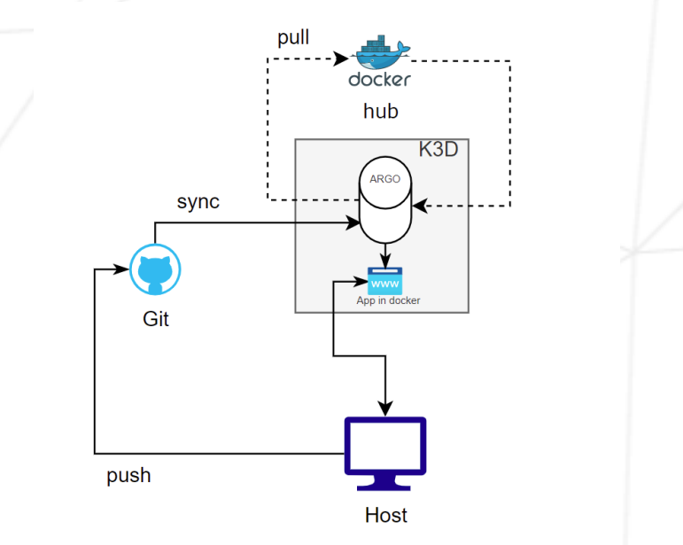

# Inception of Things (IoT) - README

## Overview

This project is designed to deepen your knowledge of Kubernetes by using lightweight distributions like K3s and K3d in combination with Vagrant for virtualization. The project is divided into three parts:

1. **Part 1**: Setting up K3s with Vagrant to create a minimal Kubernetes cluster.
2. **Part 2**: Deploying three web applications on K3s with proper routing using Ingress.
3. **Part 3**: Implementing K3d and ArgoCD for continuous integration and application deployment.

Additionally, a bonus task introduces GitLab integration with the K3d cluster.

## Prerequisites

- Vagrant (latest stable version)
- VirtualBox or any other supported provider
- Docker
- kubectl
- Git and a public GitHub repository
- Basic understanding of Kubernetes, Docker, and continuous integration concepts

---

## Project Structure

- **Part 1**: [K3s and Vagrant](#part-1-k3s-and-vagrant)
- **Part 2**: [K3s and Three Applications](#part-2-k3s-and-three-applications)
- **Part 3**: [K3d and Argo CD](#part-3-k3d-and-argo-cd)
- **Bonus**: [GitLab Integration](#bonus-gitlab-integration)

---

### Part 1: K3s and Vagrant

1. **Set up two VMs using Vagrant:**
   - Machine 1 (Server): Hostname `<username>S`, IP `192.168.56.110`
   - Machine 2 (ServerWorker): Hostname `<username>SW`, IP `192.168.56.111`
   
2. **Install K3s:**
   - Machine 1: Controller mode
   - Machine 2: Agent mode

3. **Configure Passwordless SSH Access:**
   - Use `kubectl` to interact with the cluster.

### Part 2: K3s and Three Applications

1. Set up a single VM with K3s in server mode.
2. Deploy three web applications:
   - App 1: Accessible via `app1.com`
   - App 2: Accessible via `app2.com` with 3 replicas
   - App 3: Default fallback
3. Configure Ingress to route requests based on the hostnames.

### Part 3: K3d and Argo CD

1. **Install K3d:**
   - Use Docker to manage the cluster.
   - Write a script to automate package and tool installation.

2. **Set Up Argo CD:**
   - Create two namespaces: `argocd` and `dev`.
   - Deploy an application in the `dev` namespace using Argo CD.
   - Application must have two versions (e.g., `v1`, `v2`) managed via a public DockerHub repository.

3. **Demonstrate CI/CD:**
   - Push changes to GitHub and verify automatic updates in the application.

### Bonus: GitLab Integration

1. Install and configure GitLab locally.
2. Integrate GitLab with the K3d cluster.
3. Create a dedicated namespace `gitlab` for the GitLab

