# Deploy a POD and inspect it's infos:


```bash
echo "export KUBECONFIG=/etc/rancher/k3s/k3s.yaml" >> ~/.bashrc
source ~/.bashrc
kubectl get all
kubectl get pods
kubectl get pods -all 
kubectl get pods -A 
kubectl get nodes
kubectl run nginx --image nginx 
kubectl get pods 
kubectl cluster-info 
kubectl get pods 
kubectl get nodes 
kubectl describe nodes 
kubectl get pods -o wide 
kubectl get pod -o=custom-columns=NAME:.metadata.name,STATUS:.status.phase,NODE:.spec.nodeName --all-namespaces
kubectl get pods -o wide --all-namespaces --sort-by="{.spec.nodeName}" 
```

# Deploy a Pod using YAML:

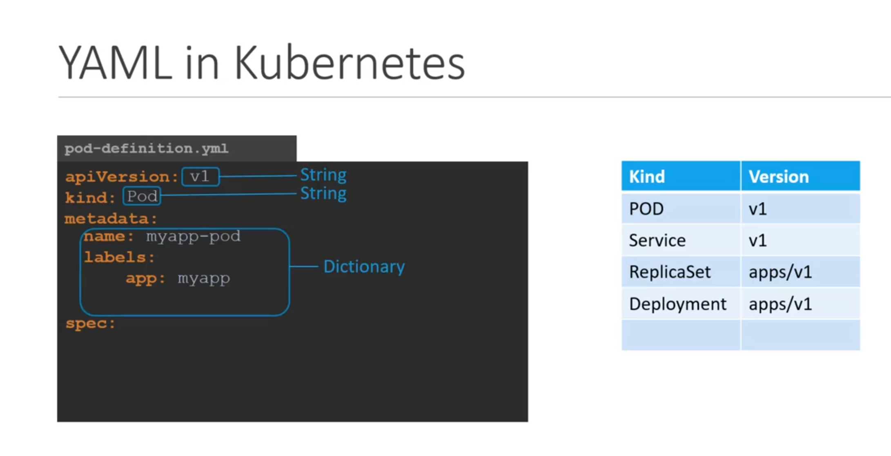


```yaml

apiVersion: v1
kind: Pod
metadata:
    name: my-pod-test
    labels:
        app: pod-app
        type: test-pod
spec:
    containers:
    - name: nginx-pod
      image: nginx

```

# ReplicationController:


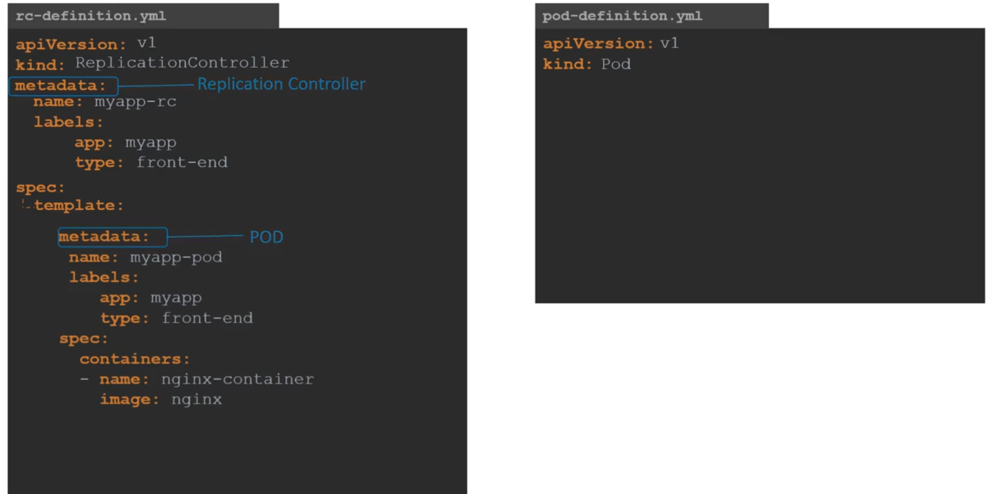


```yaml
apiVersion: v1
kind: ReplicationController
metadata:
  name: rc-test
  labels:
    app: rc-app
    type: test-rc
spec:
  replicas: 3
  template:
    metadata:
      name: my-pod-test
      labels:
        app: pod-app
        type: test-pod
    spec:
      containers:
      - name: nginx-pod
        image: nginx
```

# ReplicaSet (Labels and Selectors):

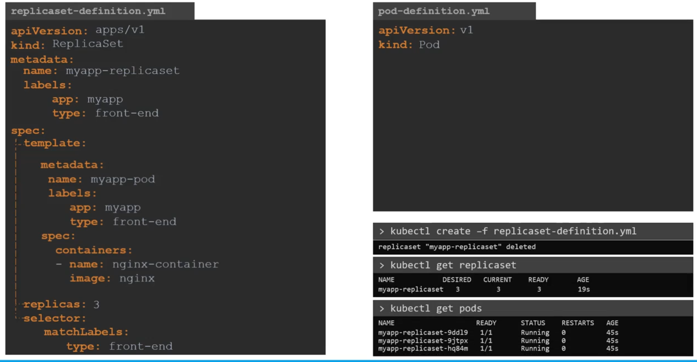
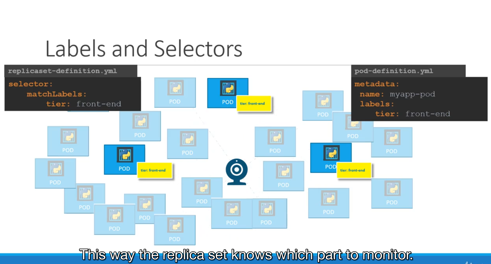

## Scale:

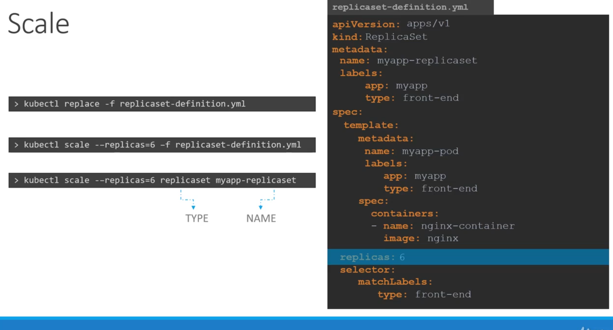

## Relevant commands:


# Deployment:

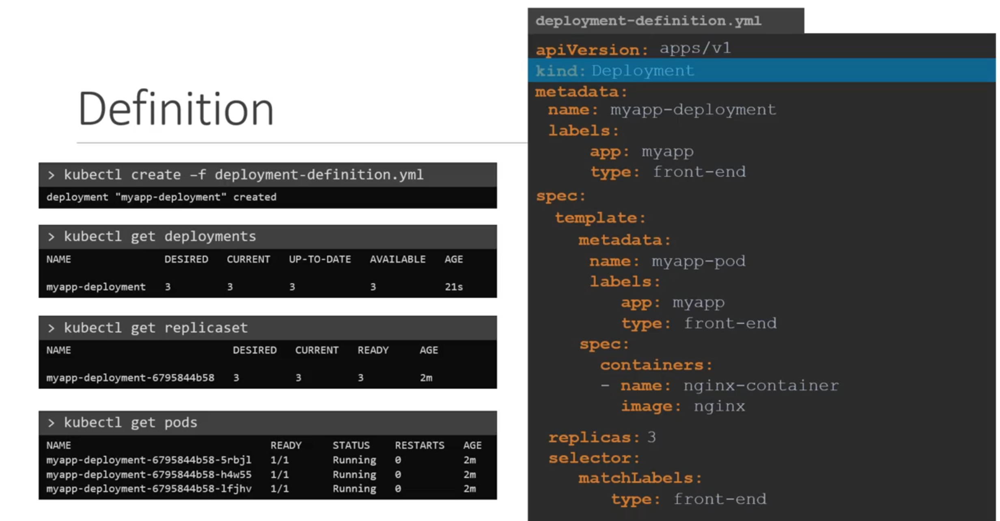

```yaml

# example of a deployment

apiVersion: apps/v1
kind: Deployment
metadata:
  name: my-deployment-app
  labels:
    app: deploy-app
    type: test-deploy
spec:
  template:
    metadata:
      name: my-pod-app
      labels:
        app: pod-app
        type: test-pod
    spec:
      containers:
      - name: nginx-pod
        image: nginx
  revisionHistoryLimit: 15
  replicas: 3
  selector:
    matchLabels:
      type: test-pod

```


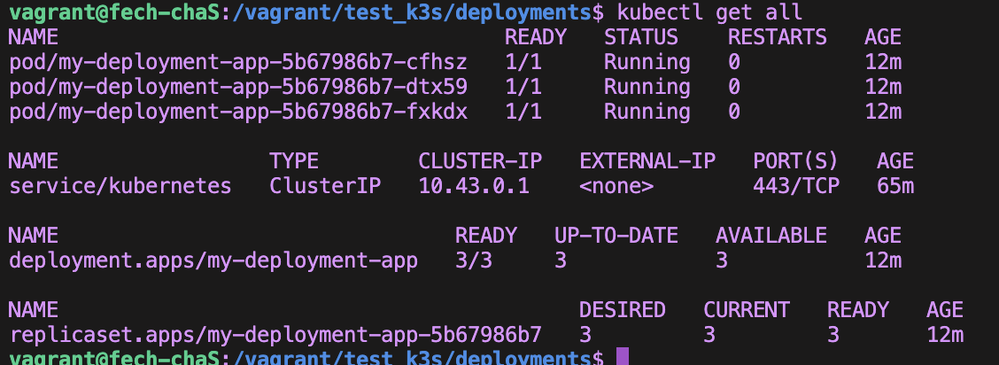

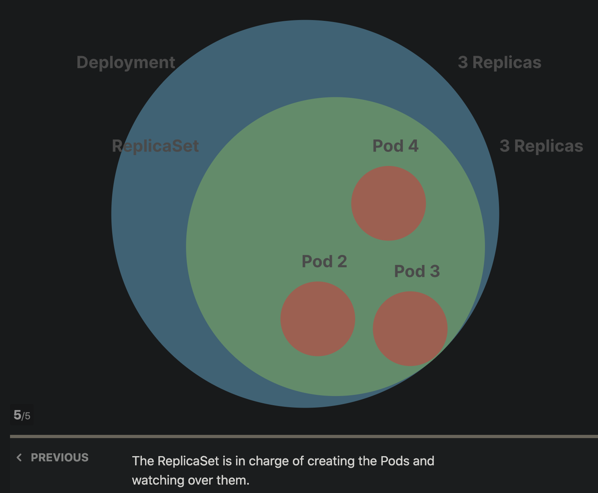

In Kubernetes, the `apiVersion` field specifies the API group and version for the Kubernetes resource being defined. The key difference between `apiVersion: apps/v1` and `apiVersion: v1` lies in the **API group** they belong to and the resources they manage:

### **`apiVersion: v1`**
- Belongs to the **core (default) API group**, which doesn't have a name.
- Used for core Kubernetes objects like:
  - **Pods**
  - **Services**
  - **ConfigMaps**
  - **Secrets**
  - **PersistentVolumes (PVs)**
  - **PersistentVolumeClaims (PVCs)**
  - **Namespaces**
  - **Nodes**
- Example:
  ```yaml
  apiVersion: v1
  kind: Pod
  metadata:
    name: my-pod
  spec:
    containers:
    - name: nginx
      image: nginx:latest
  ```

---

### **`apiVersion: apps/v1`**
- Belongs to the **apps API group**, introduced to handle higher-level abstractions related to deploying and managing applications.
- Used for managing workload resources like:
  - **Deployments**
  - **DaemonSets**
  - **StatefulSets**
  - **ReplicaSets**
- Example:
  ```yaml
  apiVersion: apps/v1
  kind: Deployment
  metadata:
    name: my-deployment
  spec:
    replicas: 3
    selector:
      matchLabels:
        app: nginx
    template:
      metadata:
        labels:
          app: nginx
      spec:
        containers:
        - name: nginx
          image: nginx:latest
  ```

---

### Key Differences:
| Feature                  | `apiVersion: v1`                    | `apiVersion: apps/v1`         |
|--------------------------|--------------------------------------|--------------------------------|
| **API Group**            | Core (default) group                | `apps` group                  |
| **Resources Managed**    | Core objects (e.g., Pods, Services) | Workload resources (e.g., Deployments, StatefulSets) |
| **Purpose**              | Basic Kubernetes building blocks    | Application deployment and scaling |

When deciding between the two, it depends on the resource you are defining. Always consult the Kubernetes documentation or use `kubectl api-resources` to see the appropriate `apiVersion` for the resource.

## Updates and Rollbacks:
### Rollout and versioning:

* after creating a new deployment: 

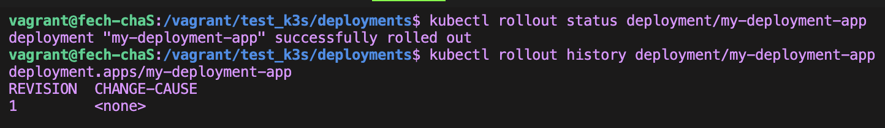

* after an update to the deployment:

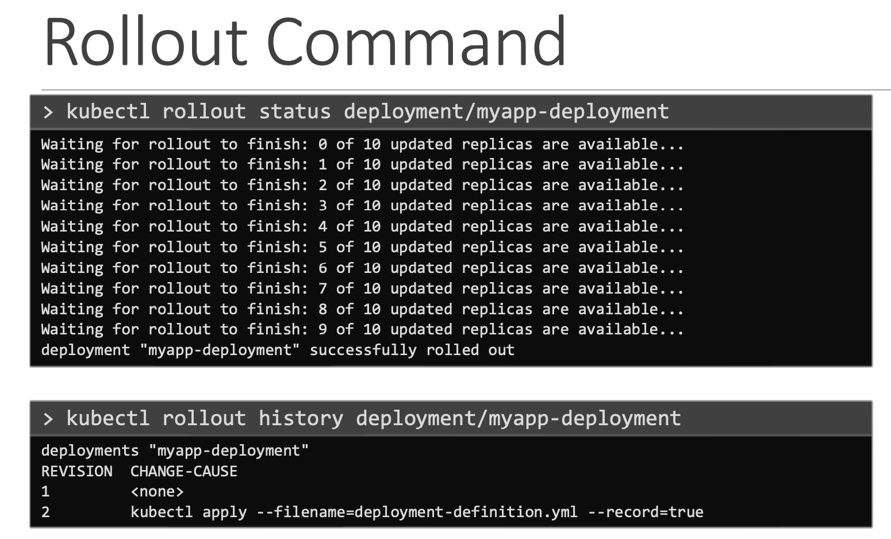

* full review (it also creates a new replicaset):

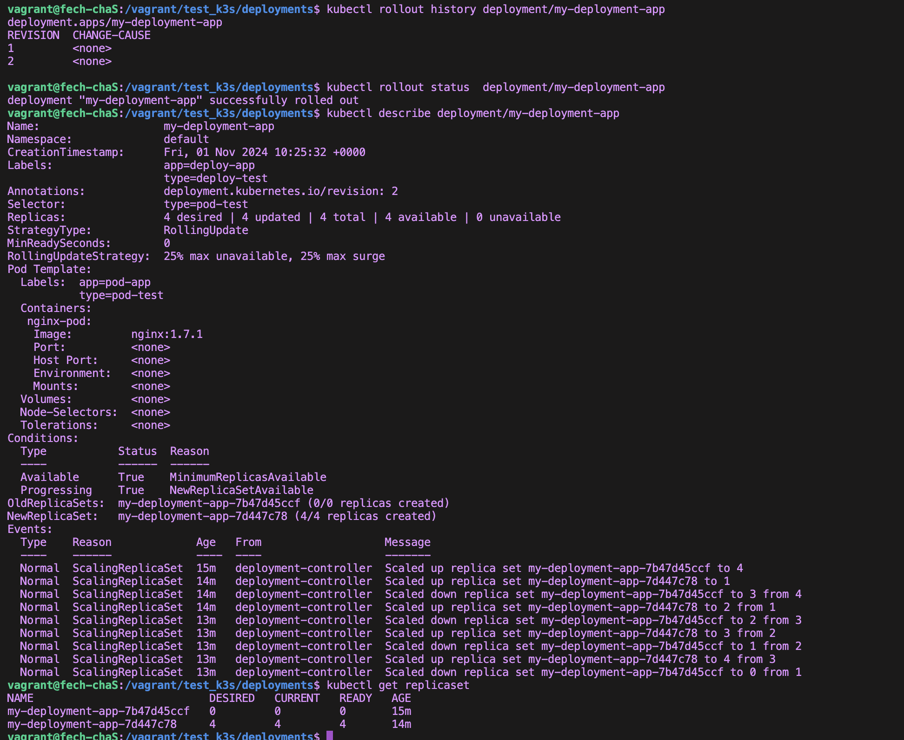

* record a rollout:

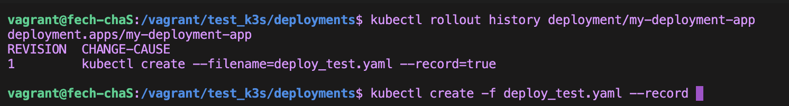

### Updates and Rollbacks:

* great resource: https://learnk8s.io/kubernetes-rollbacks

* rollback to a specific version:

```bash
$ kubectl rollout undo deployment/my-deployment-app --to-revision=3
```

# Services: 

* Services enable the front-end application to be made available to users, it helps communication between back-end and front-end PODs, and helps in establishing connectivity to an external data source. Thus services enable loose coupling between microservices in our application.

## Nodeport:

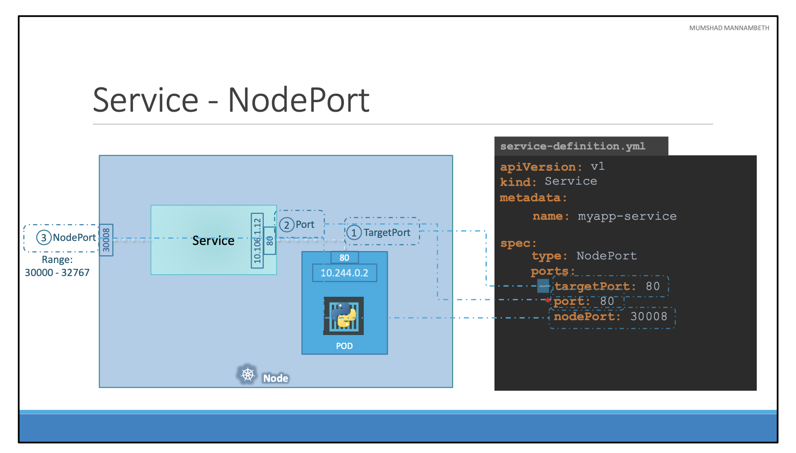

* Link services to pods using `selector` and `label`:


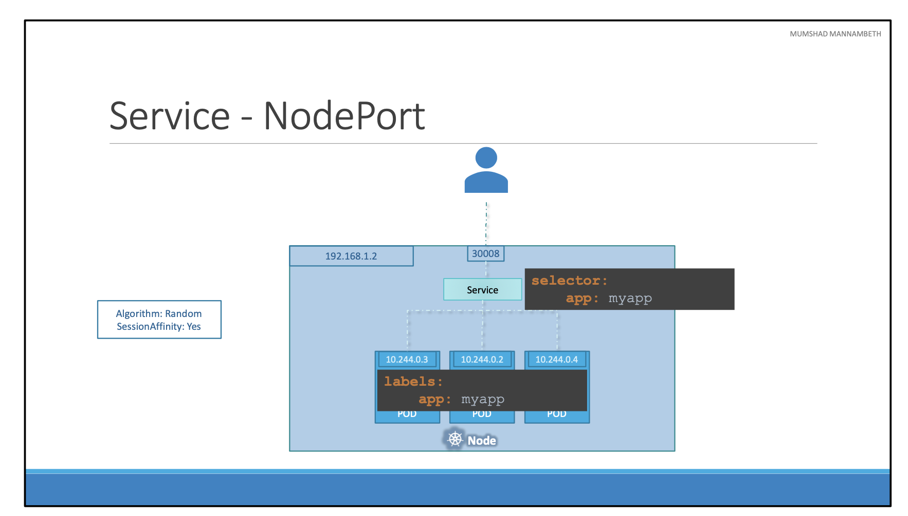

* Services could manage PODs on multiple Nodes:

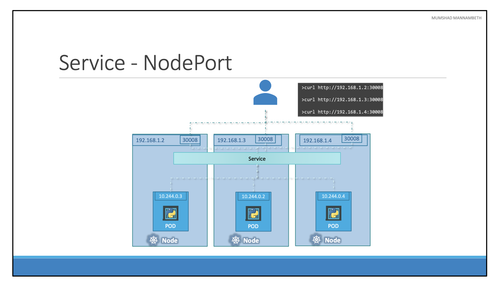

* The `ClusterIP` type makes the service accessible within the cluster (for internal communication). You could change it to `NodePort` or `LoadBalancer` if you need external access.

# k3d:
- resource: 
https://www.youtube.com/watch?v=mCesuGk-Fks&list=PLvFOdZBrBEqXIiC6wuHMq2Clq7_dGLEiD&index=17&ab_channel=DevOpsToolkit

- install on linux:
```bash
wget -q -O - https://raw.githubusercontent.com/k3d-io/k3d/main/install.sh | bash
```

- create cluster:
```bash
k3d cluster create my-cluster
```
- after install :
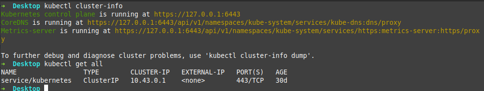

- to check if the cluster running as a container, check docker:
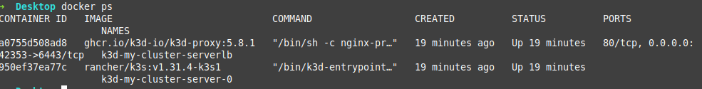
* two containers, one for k3s cluster, one will proxy the request to the cluster container.

- delete a cluster:
```bash
k3d cluster delete my-cluster
```

- k3d config files to create clusters (k3d.yaml): 
```yaml
# required fields
apiVersion: k3d.io/v1alpha5
kind: Simple
name: my-cluster
image: rancher/k3s:latest
# control plane/ master nodes:
servers: 3
# agent/worker nodes:
agents: 3
ports:
  - port: 80:80 # same as `--port '8080:80@loadbalancer'`
    nodeFilters:
      - loadbalancer
```

- create cluster with config file:
```bash
k3d cluster create --config k3d.yaml
```

## todo:
- resource of the project:
https://github.com/wen/iot/wiki
### K3D:
- k8s context vs namespace
- switch between k3d and default context
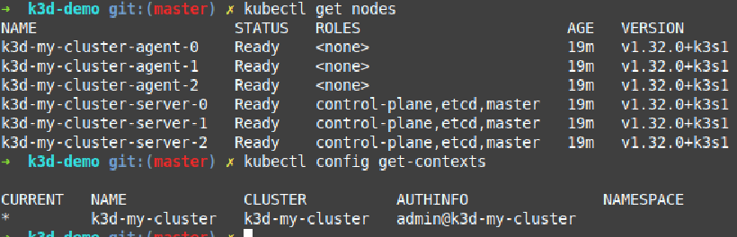

### IOT:
- set up dashboard
https://dev.to/lucyllewy/install-and-access-the-k8s-web-ui-dashboard-on-a-k3s-cluster-4370
- secure k3s token:
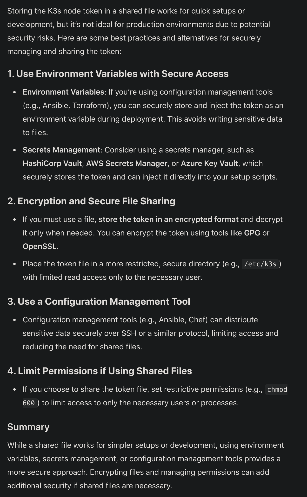

- equivalent of eth1:


- install netools in server agent 
- config k3s server agent (https://docs.k3s.io/installation/configuration)
- create eth1 for linux machines (agent/server)

* p2:
- the type of service should be ClusterIP
- app3 should be selected by default
- check why nodes create in server as well
